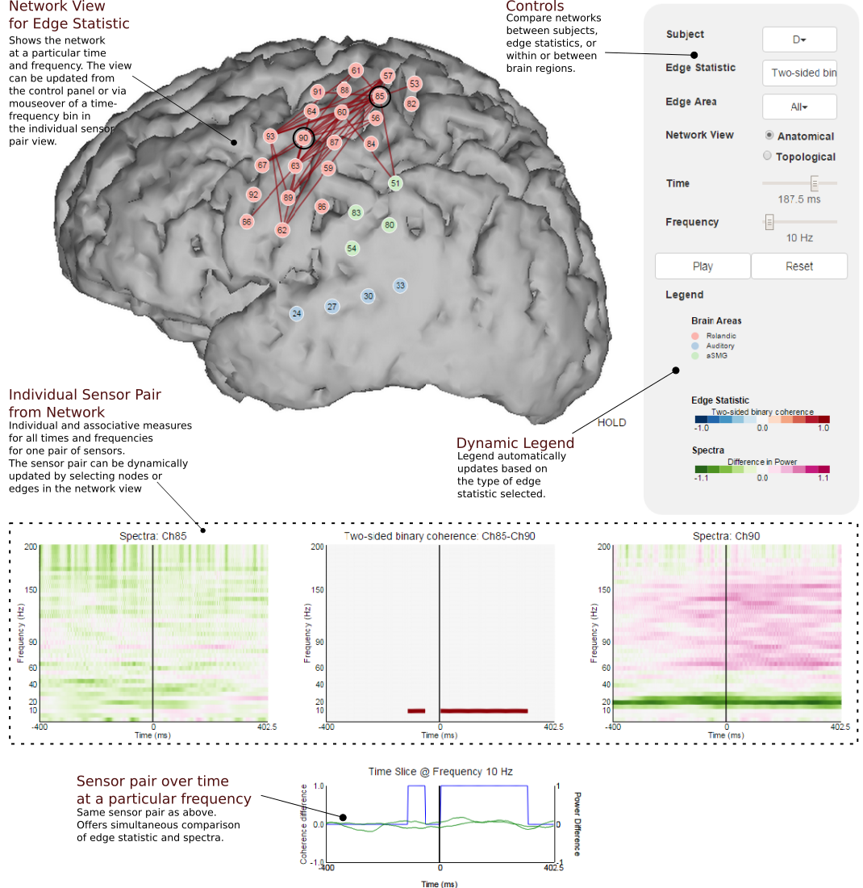

**Detail**: A working example of the SpectraVis code with the ECOG overt reading task can be found [online][1][^1]. The code itself is accessible in a [Github repository][2][^2] and is free to use under the [GPL-2.0](http://choosealicense.com/licenses/) open source license. [@fig:figure1] shows a typical view of the SpectraVis application. The network view shows the anatomical location of the sensors (circles with sensor number) and edges (lines) weighted by a measure of statistical association between the sensors (the edge statistic). In this case, the edges represent significant changes in local field potential coherence between *Speech* --- subjects reading the words of the Gettysburg Address --- and *Silence* at a particular frequency (10 Hz) and time (187.5 ms after speech onset). Below the network view is a individual sensor view (dotted box), which depicts the relationship (spectra and coherences) between a particular pair of sensors (sensors circled in black in the network view) at all times and frequencies. This allows for comparison between individual electrode pairs and the network. Users can use the Controls to compare subjects, edge statistics (e.g correlation instead of coherence), and the network at other times and frequencies. The network can also be changed to the "topological view" which tries to place network nodes so that the structure of the network can be more easily seen.

{#fig:figure1}

[1]: http://ericdeno.com/research/SpectraVis
[2]: https://github.com/edeno/SpectraVis

[^1]: http://ericdeno.com/research/SpectraVis
[^2]: https://github.com/edeno/SpectraVis
